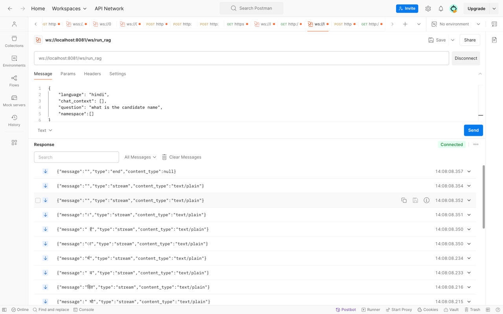

# RAG with Agents

## Overview

This repository implements a Retrieval-Augmented Generation (RAG) system using AI agents. The system fetches relevant data from a vector database and generates responses based on user queries.

## Features
- Retrieval-augmented generation for answering questions based on stored documents.
- WebSocket and REST API support for interaction.
- Multi-agent architecture for handling different types of queries.

## System Architecture
### High-Level Flow
- Ingestion: Uploads documents to the system and processes them for retrieval.
- Storage: Stores processed documents in a vector database. 
- Retrieval: Extracts relevant documents based on user queries. 
- Generation: Uses LLMs to generate responses from retrieved documents. 
- Response: Provides results via API (HTTP or WebSocket).

## Installation

### Prerequisites
- Python 3.8+
- Required dependencies (install using `requirements.txt`)

### Setup
1. Clone the repository:
   ```bash
   git clone https://github.com/mohitvverma/rag_with_agents.git
   cd rag_with_agents
   ```
2. Install dependencies:
   ```bash
   pip install -r requirements.txt
   ```
3. Run the application:
   ```bash
   python service.py
   ```

## API Endpoints

### 1. **Ingest API**
#### Endpoint:
```
POST /ingest
```
#### Request Body:
```json
{
  "request_id": 0,
  "response_data_api_path": "string",
  "pre_signed_url": "string",
  "file_name": "string",
  "original_file_name": "string",
  "file_type": "string",
  "process_type": "string",
  "params": {},
  "metadata": [{}],
  "namespace": "default_dev"
}
```
#### Description:
Used for ingesting documents into the vector database.

### 2. **Run Agents API**
#### Endpoint:
```
GET /run_agents?query=<query>&thread_id=<thread_id>
```
#### Query Parameters:
- `query`: The user’s query.
- `thread_id`: Unique thread identifier.
#### Response:
```json
{
  "result": "<generated response based on retrieved documents>"
}
```
#### Description:
Processes the user’s query by retrieving relevant information from stored data and generating an appropriate response.

### 3. **WebSocket API for Real-time Interaction**
#### Endpoint:
```
ws://localhost:8081/ws/run_rag
```
#### Request Payload:
```json
{
  "language": "hindi",
  "chat_context": [],
  "question": "what is the candidate name",
  "namespace": []
}
```
#### Response:
Streaming JSON messages with generated text.

## Example Usage
### Run Agents API Example
```bash
curl -X GET "http://localhost:8081/run_agents?query=tell me the candidate name&thread_id=new_123"
```
### WebSocket RAG Example


### GetAPI Agents Example

## License
This project is licensed under the MIT License.

